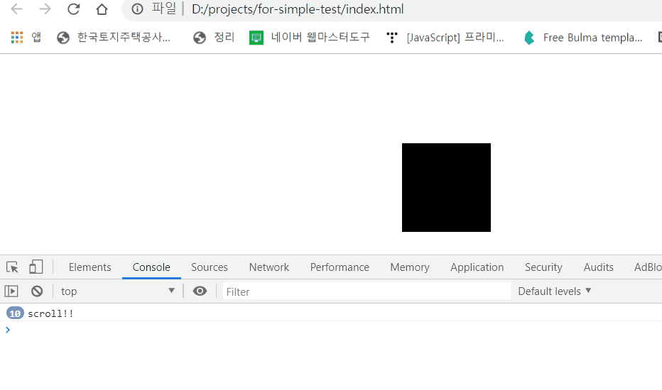
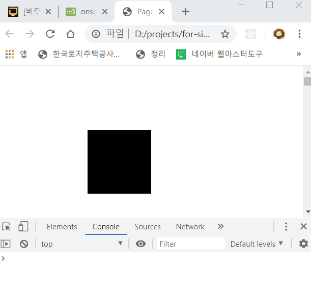

과거에 작성된 글입니다.

## 쓰로틀링이란 무엇인가?

쓰로틀링은 주로 이벤트 등에 사용되는 프로그래밍 기법입니다.

흔히 스크롤 액션 같은 이벤트에 사용됩니다.

## 쓰로틀링의 작동 방식

쓰로틀링의 정의를 간단하게 짚고 넘어가겠습니다.

> 함수가 호출된 후 일정 시간동안 함수가 다시 호출되지 않도록 막는 것.

여기서 **일정 시간**동안 함수 호출을 막는다는 것이 핵심입니다.

아래와 같은 scroll 이벤트를 봅시다.
box가 scroll 될 때마다 display 속성이 none~block으로 토글되는 이벤트입니다.

```javascript
let targetState = true;

function eventScroll() {
  const target = document.querySelector('.box');
  targetState = !targetState;
  if (targetState) {
    target.style.display = 'block';
  } else {
    target.style.display = 'none';
  }
  console.log('scroll!!');
}
```

---



_scroll 이벤트가 쉬지 않고 발생한다._

클라이언트 입장에서는 충분히 스크롤을 마구 굴릴 수 있습니다. 이렇게 되면 정성스럽게 짜놓은 이벤트 함수가 고장날 수도 있습니다. (특히 복잡하다면)

그래서 이런 이벤트에 필요한 기법이 쓰로틀링입니다. 쓰로틀링이란 event 함수를 일정 주기동안 제한하는 기법이라 앞서 언급했습니다.

위와 같은 상황에선, 스크롤 이벤트가 발생한 후 일정시간동안 scroll이벤트가 다시 발생하지 않도록 제한하는 것이 되겠죠.

위 코드에 쓰로틀링을 추가해보겠습니다.

```javascript
let targetState = true;
let timer;

function eventScroll() {
  if (!timer) {
    timer = setTimeout(() => {
      const target = document.querySelector('.box');
      targetState = !targetState;
      if (targetState) {
        target.style.display = 'block';
      } else {
        target.style.display = 'none';
      }
      console.log('scroll!!');
      timer = null;
    }, 1000);
  }
}
```

---



_이벤트가 1초에 한 번씩만 작동하고 있다._

setTimeout 함수를 이용하는 방법입니다. 이벤트가 발생할 때마다 timer에는 수행할 로직이 지정되고, 모든 일을 마친 후 스스로 초기화 합니다. 이 과정에 setTimeout함수가 끼어들어 1000ms라는 딜레이를 부여합니다.

저는 1000ms로 지정했지만, 딜레이 간격은 얼마든지 수정할 수 있습니다.
