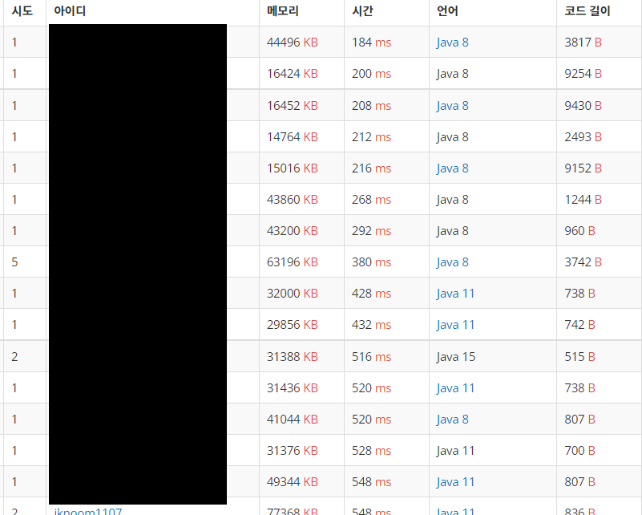
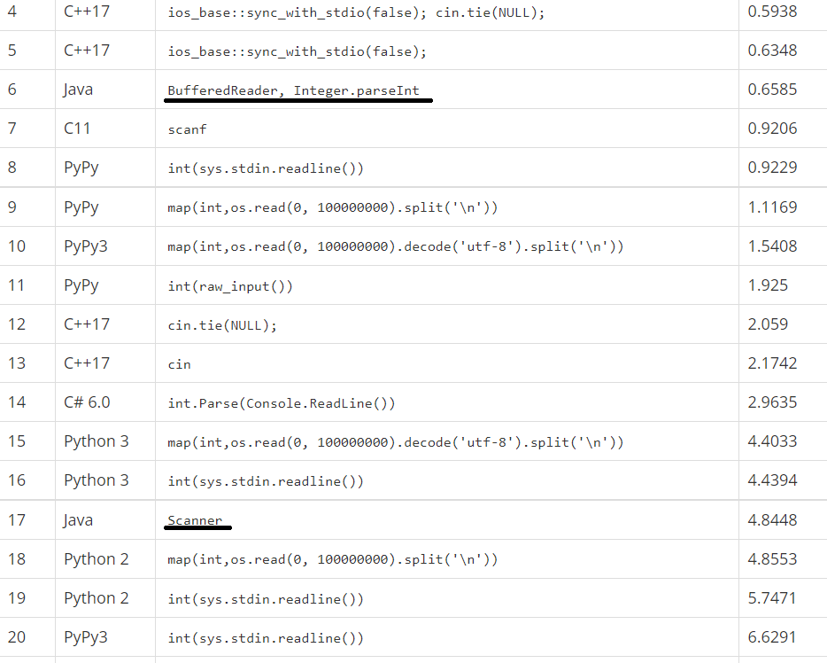

블로그의 형태를 어느정도 잡아둔 후, 저는 예정대로 [백준](https://www.acmicpc.net/)에서 알고리즘 문제를 풀기로 했습니다. 개발자가 되고싶다는 사람이 알고리즘을 소홀히 했다는 죄책감도 있고, 요즘은 코딩테스트가 필수이기도 하니까요.

저는 그나마 배운적 있는 언어인 C와 Java중 Java를 선택했습니다. 그리고 호기롭게 '단계별로 풀어보기'에 도전했죠.

'단계별'이라는 말에 걸맞게 처음 마주한 문제들은 수월히 풀어나갔습니다. 문법을 제대로 이해했는지를 묻는 문제가 다수였습니다.

그렇게 몇 문제를 풀어나가던 도중, 저는 뭔가 이상함을 느꼈습니다.

## 왜 나만 느리지?

다른 좋은 답안들을 참고하려했는데, 메모리나 속도의 차이가 너무 심했습니다.


_다른 분들의 답_


_제가 제출한 답_

다른 문제들도 마찬가지였습니다.
메모리와 시간에서 2배에서 3배정도까지 차이가 났습니다.

저는 어떤차이가 있는지 궁금해서 결국 다른분들의 답안을 확인해봤습니다.

## 아무도 Scanner를 사용하지 않는다.

상위권에 계신 많은분들의 답을 확인해본 결과, 눈에 띄는 큰 차이가 있었습니다. 그것은 아무도 Scanner나 System.out.print~를 사용하지 않는다는 것이었습니다.

그 대신 BufferedReader, InputStreamReader를 import하는 코드가 압도적으로 많았습니다.

## 속도 차이가 얼마나 나는걸까?

저는 이것만으로 그렇게 큰 차이가 날 수 있는 것인지 의문이 들었습니다. 하지만 어떤 답안을 들여다 봐도 Scanner의 메소드를 사용하는 답안을 찾을 수 없었습니다. 때문에 저는 이것이 얼마나 큰 차이를 만들어내는지 궁금했습니다.

그러던 와중 [입력 속도 비교](https://www.acmicpc.net/blog/view/56) 글을 발견했습니다.

글 내용에 따르면, BufferedReader의 속도는 C++이나 C에 비견될 만큼 빠르지만, Scanner는 Python과 비슷한 정도로 느리다고 합니다.



차이가 이렇게 심하다고 하니 또 궁금해졌습니다.

제가 제출한 코드에 Scanner가 아닌 BufferedReader를 사용하면 속도가 얼마나 빨라질지 말이죠. 그래서 바로 적용해보기로 했습니다.

순수하게 Scanner와 BufferedReader의 차이만을 확인하기 위해, 최대한 간단한 문제를 골랐습니다.

[백준 1000번 문제](https://www.acmicpc.net/problem/1000)입니다.

문제는 간단합니다. A와 B를 입력받은 후 A+B를 출력하는 것입니다.

우선 원래하던 방식대로 Scanner를 활용해서 문제를 풀어보았습니다.

```java
import java.util.Scanner;

public class Main {

	public static void main(String[] args) {

		Scanner scanner = new Scanner(System.in);

		short a = scanner.nextShort();
		short b = scanner.nextShort();

		System.out.println(a + b);

	}
}
```

결과는 이렇습니다.


그리고 BufferedRedaer를 사용해서 한번 더 풀어보았습니다.

```java
import java.io.BufferedReader;
import java.io.IOException;
import java.io.InputStreamReader;
import java.util.StringTokenizer;

public class Main {

	public static void main(String[] args) throws IOException {

		BufferedReader br = new BufferedReader(new InputStreamReader(System.in));
		StringTokenizer st = new StringTokenizer(br.readLine());
		short a = Short.parseShort(st.nextToken());
		short b = Short.parseShort(st.nextToken());

		System.out.println(a + b);

	}
}
```

> BufferedReader외에 많은것들이 import되고 사용되었는데, 이에 대해선 다음 포스트에서 설명하겠습니다.

그 결과는 이렇습니다.


엄청난 차이는 아니지만 확실히 차이가 있네요. 코드도 더 길어졌는데 말이죠. 상위권 답안도 살펴보았는데 메모리는 큰 차이가 안났지만 시간이 68~70ms로 제 답안과 큰 차이가 났었습니다.

그 답안들도 살펴보았는데 문제가 워낙 단순하다보니 StringTokenizer를 사용하지 않고 split 한다던가, System.in.read를 사용하는 방식으로 속도를 높힌 코드들이었습니다.

저는 그정도까지 극단의 효율을 추구할 생각은 없기 때문에 이정도에서 만족하기로 했습니다.

다음 시간에는 BufferedReader의 사용법을 게시하겠습니다.
