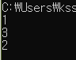

# 자바스크립트의 비동기 처리 방식

닳고 닳은 코드이지만... 아래 코드를 봅시다.

```javascript
console.log('1');

setTimeout(() => {
  console.log('2');
}, 0);

console.log('3');
```

비동기에 대한 이해가 없으실 경우, 예측 결과는 1, 2, 3입니다. 하지만 실제 결과는 이렇습니다.



어떻게 이런 일이 발생한 걸까요?

이는 setTimeout이 비동기API이기 때문입니다.
이처럼 자바스크립트는 비동기코드를 만날 경우 평소와 다르게 작동합니다.

## 비동기 코드의 작동 순서

비동기API가 포함된 코드는 이렇게 작동합니다.

1. 비동기 코드가 아닌 코드를 순서대로 실행합니다.
2. 비동기 API를 만났습니다.
3. 비동기 API의 실행을 나중으로 미룹니다.
4. 나머지 코드를 실행 시킵니다.
5. 미뤄두었던 비동기 코드를 실행합니다.

즉, 비동기API는 다른 코드가 실행된 후 마지막에 실행되기 때문에 위와 같은 결과가 나올 수 있었습니다.

여기까지의 내용은 자바스크립트를 자주 다뤄오신 분들이라면 이미 아는 내용이실거고, 이해하기 쉬운 내용입니다.

저는 여기서 **구체적으로 어떤 과정을 통해** 이런 작동을 하는지 궁금했습니다. 이글은 이에 대해 알아보고 정리한 글입니다.

## 자바스크립트 엔진의 구조

자바스크립트는 브라우저에서 돌아갑니다. 브라우저는 자바스크립트 코드를 해석하고 실행하기 위해 자바스크립트 엔진을 탑재하고 있습니다. 아마 V8엔진같은 말을 들어 보셨을겁니다.

브라우저는 이 자바스크립트 엔진을 이용하여 코드를 해석하고, 실행한다는 것이죠.

비동기 코드가 어떻게 처리되는가. 이것을 알아보려면 자바스크립트 엔진의 구조와 작동 방식을 뜯어보아야 합니다.


간단하게 그려진 자바스크립트 엔진의 구조입니다.
메모리 힙을 제외한 요소들을 하나씩, 간단하게, **비동기 코드 처리를 어떻게 하는지**에 초점을 맞춰서 정리해보겠습니다.

## 콜 스택(Call Stack)

코드가 실행될 호출 스택입니다. LIFO(Last In, First Out) 후입선출이라고도 하는 구조를 갖고 있습니다.
자바스크립트는 콜 스택을 하나만 가지고 있습니다. 즉, 싱글 스레드라는 뜻입니다. 한 번에 하나의 일만 진행할 수 있다는 의미입니다.

저처럼 호출 스택이란 단어를 처음 접하셨다면 단어가 생소하실지도 모르겠습니다. 호출 스택이란 간단히 말해서 프로그램을 실행하며 만나게되는 여러 함수(Function)의 실행 순서를 의미합니다. 다음과 같은 간단한 코드를 보고, 콜 스택에 어떻게 담기게 될지 예측해보는 시간을 가져보겠습니다.

```javascript
function foo() {
  console.log('foo');
}
function bar() {
  foo();
}

bar();
```

이 코드를 보고 저희가 예상할 수 있는 순서는 다음과 같습니다.

1. bar 호출.
2. foo 호출.
3. console.log('foo'); 를 실행

네, 이와 같은 순서가 콜 스택에서 진행됩니다.
위 코드가 콜스택에서 어떤 동작을 하는지 살펴보겠습니다.


콜 스택 내부에서도 저희가 예측한 순서대로 진행됩니다.

이런 코드는 어떻게 될까요?

```javascript
function foo() {
  foo();
}
foo();
```

이 코드는 foo함수를 무한하게 부르게 됩니다. 콜 스택에도 한계가 있기 때문에 이런 경우엔 오류를 발생시킵니다. 그 유명한 Stack Overflow 입니다.

## Web APIs

자바스크립트 엔진이 아닌 브라우저가 내장한 API입니다. 대표적으로 setTimeout, Event Handler, Ajax등이 있습니다.

비동기 코드를 발견하면 자바스크립트 엔진은 Web API를 호출합니다. Web APIs는 비동기 함수를 콜 스택에서 끌고와 콜 스택과 별개로, 따로 실행 시킵니다. 자바스크립트는 싱글 스레드이지만, 멀티 스레드처럼 작동할 수 있도록 돕는 것이 바로 이 친구였습니다.

Web APIs는 비동기 코드를 실행한 뒤, 콜백 함수를 콜백 큐로 집어넣습니다.

## 콜백 큐 (Callback Queue)

비동기코드가 실행된 후 마무리로 실행되어야 할 콜백 함수가 머무는 곳입니다. 콜 스택은 아랑곳 하지 않고 코드를 계속 실행시킵니다. 콜백 큐에 있는 함수들은 콜 스택이 모든 일을 마칠 때까지 기다립니다.

## 이벤트 루프(Event Loop)

이벤트 루프는 콜 스택과 콜백 큐를 관찰합니다. 콜 스택이 모든 일을 마치면 콜백 큐에 있는 태스크가 스택으로 옮겨질 수 있도록 돕는 역할을 합니다.

네, 스택이 비동기 콜백함수를 제외한 모든 일을 마치고 나서야 이벤트 루프는 콜백 큐에 있는 태스크를 스택으로 다시 옮겨주게 됩니다.

정리하면 이렇습니다.

1. 자바스크립트 엔진은 코드를 읽으며 실행 순서를 콜 스택에 쌓아갑니다.
2. 코드를 읽던 도중 비동기 처리가 필요한 코드를 만나면 Web APIs에게 주도권을 넘깁니다.
3. Web APIs는 비동기 코드를 콜 스택에서 끌어와 따로 실행합니다. (가령 setTimeout이라면 카운트를 콜 스택과 별개로 진행합니다.)
4. 콜백 함수를 콜백 큐로 옮깁니다.
5. 콜백 큐에 있는 실행 컨텍스트들은 콜 스택이 모든 일을 마칠때까지 기다립니다.
6. 이벤트 루프가 콜 스택이 비었음을 확인하면, 콜백 큐의 실행 컨텍스트들이 마침내 콜 스택으로 옮겨집니다.
7. 마지막으로 콜백 함수가 실행됩니다.

비동기 처리가 어떻게 진행되는지 알아보려다가 브라우저를 뜯어보게 되었는데요.
저는 정말 간단하게 정리했을 뿐이고, 다른 분들의 글을 보면 더 상세한 설명을 보실 수 있을겁니다. 그 중에서도 [브라우저는 어떻게 동작하는가?](https://d2.naver.com/helloworld/59361)라는 글을 추천드립니다.

지적은 감사하게 받고 있습니다. 틀린점이 있다면 댓글로 남겨주세요.
부족한 글 읽어주셔서 감사합니다.
